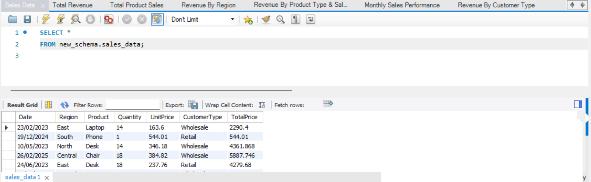
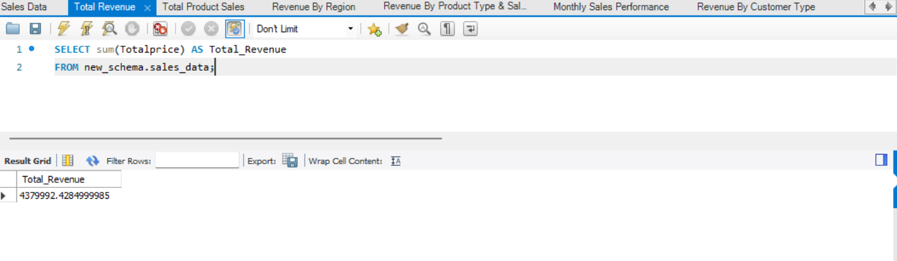
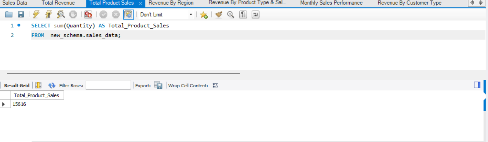
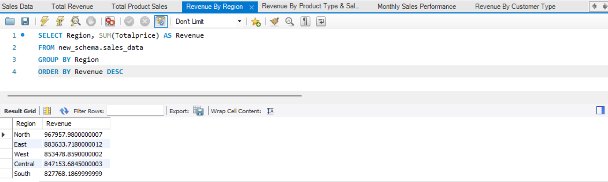
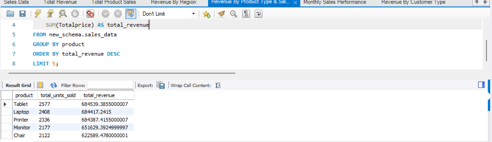
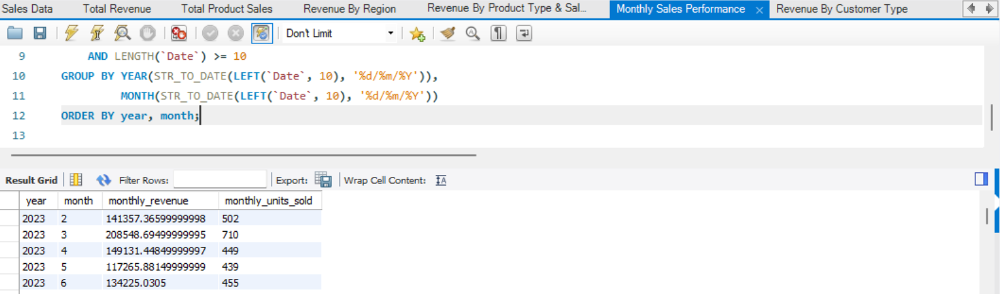

# SQL Product Sales Analysis

A modular SQL project where each business question gets its own query, turning 1,500 raw sales transactions into clear answers on revenue, regions, products, customer types, and monthly trends.



**At a glance:** $4.38M total revenue · 15,616 units sold · 1,500 transactions · 5 regions · 7 modular SQL queries

## Problem

Raw transactional sales data answers nothing on its own. Leadership wants to know which regions, products, and customer types drive revenue, and how performance moves month to month. This project answers those questions with focused SQL queries that anyone can run, read, and reuse independently.

## Key Findings

| Metric | Value |
|---|---|
| Total Revenue | $4,379,992 |
| Total Units Sold | 15,616 |
| Peak Month | March 2023: $208,549 |
| Lowest Month | October 2023: $78,446 |
| Top Region | North: $967,958 (22.1%) |
| Retail vs Wholesale Split | 50.1% / 49.9% |
| Top Product by Revenue | Tablet: $684,539 |

## Analysis Overview

| Query | Function |
|---|---|
| Total Revenue | Consolidated revenue snapshot |
| Total Product Sales | Units and revenue across all products |
| Monthly Sales Performance | Revenue trends over time, including peak and lowest months |
| Revenue By Customer Type | Retail vs wholesale breakdown |
| Revenue By Product Type & Sales | Top performing products by revenue and units |
| Revenue By Region | Geographic sales distribution and share of total |
| Sales Data | Base view of the underlying transactions |

## Key Design Decisions

**One query per business question.** Each analysis lives in its own `.sql` file instead of one long script. This makes every query easy to read, test, and reuse on its own.

**Revenue and share together.** Regional and customer type results show both absolute revenue and percentage share, so the size of a gap is clear without extra calculation.

## Results

### Total Revenue

The business generated $4,379,992 in total revenue across all 1,500 transactions.



### Total Units Sold

Sales volume reached 15,616 units.



### Revenue by Region

| Region | Revenue | Share |
|---|---|---|
| North | $967,958 | 22.1% |
| East | $883,634 | 20.2% |
| West | $853,479 | 19.5% |
| Central | $847,154 | 19.3% |
| South | $827,768 | 18.9% |



### Top 5 Products

| Product | Revenue | Units Sold |
|---|---|---|
| Tablet | $684,539 | 2,577 |
| Laptop | $684,417 | 2,408 |
| Printer | $684,387 | 2,336 |
| Monitor | $651,629 | 2,177 |
| Chair | $622,589 | 2,122 |



### Monthly Sales Performance

Revenue peaked in March 2023 at $208,549 and bottomed out in October 2023 at $78,446.



### Revenue by Customer Type

Retail and wholesale contribute almost equally, at 50.1% and 49.9%.

## Dataset

- **File:** `Product-Sales-Region.csv.xlsx`
- **Size:** 1,500 transactions × 7 columns
- **Fields:** Date, Region, Product, Quantity, Unit Price, Customer Type, Total Price

## Tools & Technology

| Tool | Purpose |
|---|---|
| MySQL Workbench | Querying, aggregation, joins, grouping |
| Excel (.xlsx) | Input dataset |

## Applications

- **Sales Performance Tracking**: monitor revenue trends and seasonal peaks and dips
- **Regional Strategy**: identify strong and weak markets for resource allocation
- **Product Portfolio Analysis**: see which products drive revenue and volume
- **Customer Segmentation**: compare retail and wholesale contribution

## How to Run

1. Import `Product-Sales-Region.csv.xlsx` into a MySQL table using MySQL Workbench.
2. Open any `.sql` file from this repository in MySQL Workbench.
3. Update the table name in the query if yours differs, then run it.
4. Repeat for each analysis file to reproduce the results above.

## Project Structure

```
├── Monthly Sales Performance.sql
├── Revenue By Customer Type.sql
├── Revenue By Product Type & Sales.sql
├── Revenue By Region.sql
├── Sales Data.sql
├── Total Product Sales.sql
├── Total Revenue.sql
├── Product-Sales-Region.csv.xlsx   # Input dataset
├── images/                         # Screenshots used in this README
│   ├── 01-data-preview.png
│   ├── 02-total-revenue.png
│   ├── 03-total-units-sold.png
│   ├── 04-revenue-by-region.png
│   ├── 05-top-products.png
│   └── 06-monthly-performance.png
└── README.md
```
